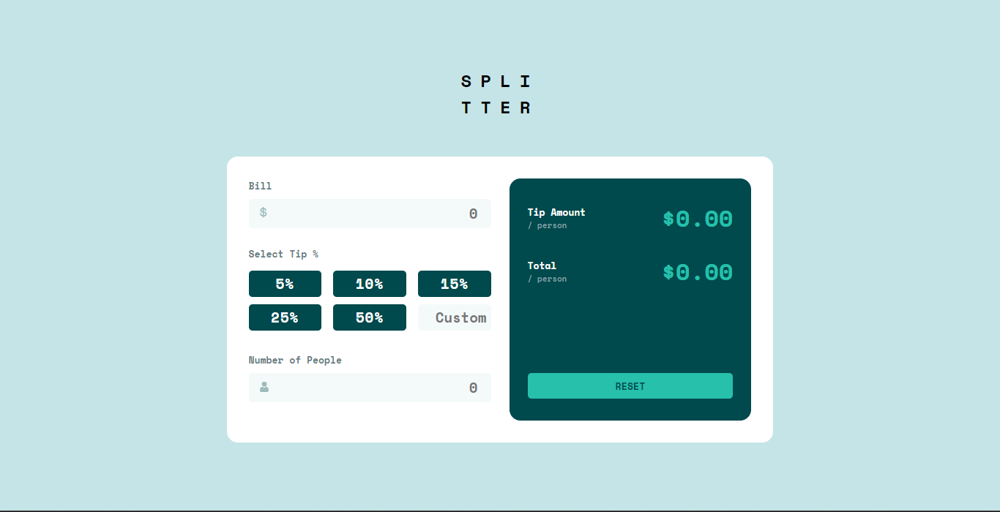

# Frontend Mentor - Tip calculator app solution

This is a solution to the [Tip calculator app challenge on Frontend Mentor](https://www.frontendmentor.io/challenges/tip-calculator-app-ugJNGbJUX). Frontend Mentor challenges help you improve your coding skills by building realistic projects.

## Table of contents

- [Overview](#overview)
  - [The challenge](#the-challenge)
  - [Screenshot](#screenshot)
  - [Links](#links)
- [My process](#my-process)
  - [Built with](#built-with)
  - [What I learned](#what-i-learned)
  - [Continued development](#continued-development)
  - [Useful resources](#useful-resources)
- [Author](#author)

## Overview

### The challenge

Users should be able to:

- View the optimal layout for the app depending on their device's screen size
- See hover states for all interactive elements on the page
- Calculate the correct tip and total cost of the bill per person

### Screenshot



### Links

- Solution URL: [https://splitter-tipcalculator.netlify.app/](https://splitter-tipcalculator.netlify.app/)

## My process

### Built with

- Semantic HTML5 markup
- CSS custom properties
- Flexbox
- CSS Grid
- Mobile-first workflow
- [React](https://reactjs.org/) - JS library
- [Sass](https://sass-lang.com/) - For styles
- Provider Pattern

### What I learned

This project give me the opportunity to keep learning about Sass. This technology let you nest and write responsive css in a really practical way.

```css
.tip_section {
  display: flex;
  flex-direction: column;
  justify-content: space-between;
  align-items: baseline;
  min-width: 100%;

  &_options {
    display: flex;
    justify-content: space-between;
    width: 100%;

    &_label {
      width: 30%;
      padding: 4px 0px;
      color: $white;
      background-color: $veryDarkCyan;
      border-radius: 5px;
      margin: 5px 0px;
      font-size: 18.5px;
      letter-spacing: 1.5px;
      cursor: pointer;

      @include breakpoints(sm) {
        font-size: 24px;
      }
    }
  }
}
```
Handling form has become easier thanks to ES6 syntax:

```js
const handleBlur = (event) => {
  event.target.value === null ||
  event.target.value === "" ||
  event.target.value < 1
    ? setErrors({
        ...errors,
        [event.target.name]: "Can't be zero",
      })
    : setErrors({
        ...errors,
        [event.target.name]: null,
      });
};

  js
const handleChange = (event) => {
  setData({
    ...data,
    [event.target.name]: event.target.value,
  });
};
```

### Continued development

For my next project I would like to divide the logic in differents files and use Typescript. 

### Useful resources

- [Function onChange and onBlur](https://bluuweb.github.io/react/formularios/) - This is an amazing article which helped me reduce code. This funcion helped me listening changes in all inputs instead of making a function for every one of them.

## Author

- Website - [Add your name here](https://www.your-site.com)
- Frontend Mentor - [@ramirezandradesara](https://www.frontendmentor.io/profile/ramirezandradesara)
- Linkedin - [Sara Ramírez](https://www.linkedin.com/in/sara-ramirez-andrade/)
